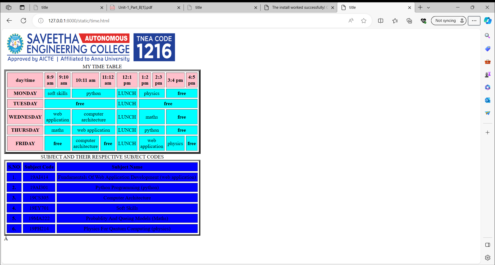

# Ex03 Time Table
## Date:15-11-2023

## AIM
To write a html webpage page to display your slot timetable.

## ALGORITHM
### STEP 1
Create a Django-admin Interface.

### STEP 2
Create a static folder and inert HTML code.

### STEP 3
Create a simple table using ```<table>``` tag in html.

### STEP 4
Add header row using ```<th>``` tag.

### STEP 5
Add your timetable using ```<td>``` tag.

### STEP 6
Execute the program using runserver command.

## PROGRAM
``````
<html>
   <title>title</title>
       <body>
        
                  <table width="540" border="6" cellspacing="4" cellpadding="4">
              <caption>MY TIME TABLE</caption>

                  <tr>
                    <th bgcolor="pink" align="center">day/time</th>
                    <th bgcolor="pink" align="center">8:9 am</th>
                    <th bgcolor="pink" align="center">9:10 am</th>
                    <th bgcolor="pink" align="center">10:11 am</th>
                    <th bgcolor="pink" align="center">11:12 am</th>
                    <th bgcolor="pink" align="center">12:1 pm</th>
                    <th bgcolor="pink" align="center">1:2 pm</th>
                    <th bgcolor="pink" align="center">2:3 pm</th>
                    <th bgcolor="pink" align="center">3:4 pm</th>
                    <th bgcolor="pink" align="center">4:5 pm</th>
                 </tr>

                  <tr>
                    <th bgcolor="pink" align="center" bgcolor="cyan">MONDAY</th>
                    <td colspan="2" align="center" bgcolor="cyan">soft skills</td> 
                    <td colspan="2" align="center" bgcolor="cyan">python</td>
                    <td align="center" bgcolor="cyan">LUNCH</td>
                    <td colspan="2" align="center" bgcolor="cyan">physics</td>
                    <th colspan="2" align="center" bgcolor="cyan">free</th>                   
                    </tr>

                  <tr>
                    <th bgcolor="pink" align="center" >TUESDAY</th>
                    <th colspan="4" align="center" bgcolor="cyan">free</th>
                    <td align="center" bgcolor="cyan">LUNCH</td>
                    <th colspan="4" align="center" bgcolor="cyan">free</thh>
                    </tr>

                  <tr>
                    <th bgcolor="pink" align="center">WEDNESDAY</th>
                    <td colspan="2" align="center" bgcolor="cyan">web application</td>
                    <td colspan="2" align="center" bgcolor="cyan">computer architecture</td>                    
                    <td align="center" bgcolor="cyan">LUNCH</td>
                    <td colspan="2" align="center" bgcolor="cyan">maths</td>                    
                    <th colspan="2" align="center" bgcolor="cyan">free</th>                    
                 </tr>

                  <tr>
                    <th bgcolor="pink" align="center">THURSDAY</th>
                    <td colspan="2" align="center" bgcolor="cyan">maths</td>
                    <td colspan="2" align="center" bgcolor="cyan">web application</td>                    
                    <td align="center" bgcolor="cyan">LUNCH</td>
                    <td colspan="2" align="center" bgcolor="cyan">python</td>                    
                    <th colspan="2" align="center" bgcolor="cyan">free</th>                    
                 </tr>

                    <tr>
                    <th bgcolor="pink" align="center">FRIDAY</th>
                    <th colspan="2" align="center" bgcolor="cyan">free</th>                    
                    <td align="center" bgcolor="cyan">computer architecture</td>
                    <th align="center" bgcolor="cyan">free</th>
                    <td align="center" bgcolor="cyan">LUNCH</td>
                    <td colspan="2" align="center" bgcolor="cyan">web application</td>                    
                    <td align="center" bgcolor="cyan">physics</td>
                    <th align="center" bgcolor="cyan">free</th>
                 </tr>

          </table>
          <table border="4" cellspacing="4" cellpadding="4">

<caption>SUBJECT AND THEIR RESPECTIVE SUBJECT CODES </caption>
                     <tr>
                    <th align="center" bgcolor="blue">S.NO</th>
                    <th align="center" bgcolor="blue">Subject Code</th>
                    <th align="center" bgcolor="blue">Subject Name</th>
                    </tr>

                     <tr>
                    <td align="center" bgcolor="blue">1.</td>
                    <td align="center" bgcolor="blue">19AI414</td>
                    <td align="center" bgcolor="blue">Fundamentals Of Web Application Development (web application)</td>
                    </tr>

                     <tr>
                    <th align="center" bgcolor="blue">2.</th>
                    <td align="center" bgcolor="blue">19AI301</th>
                    <td align="center" bgcolor="blue">Python Programming (python)</th>
                    </tr>

                     <tr>
                    <th align="center" bgcolor="blue">3.</th>
                    <td align="center" bgcolor="blue">19CS305</th>
                    <td align="center" bgcolor="blue">Computer Architecture</th>
                    </tr>

                     <tr>
                    <th align="center" bgcolor="blue">4.</th>
                    <td align="center" bgcolor="blue">19EY701</th>
                    <td align="center" bgcolor="blue"> Soft Skills </th>
                    </tr>

                     <tr>
                    <th align="center" bgcolor="blue">5.</th>
                    <td align="center" bgcolor="blue">19MA222</th>
                    <td align="center" bgcolor="blue">Probablity And Queing Models (Maths)</th>
                    </tr>

                     <tr>
                    <th align="center" bgcolor="blue">6.</th>
                    <td align="center" bgcolor="blue">19PH214</th>
                    <td align="center" bgcolor="blue">Physics For Qantum Computing (physics)</th>
                    </tr>

          </table>    
      </body>
</html>
``````

## OUTPUT


## RESULT
The program for creating slot timetable using basic HTML tags is executed successfully.
